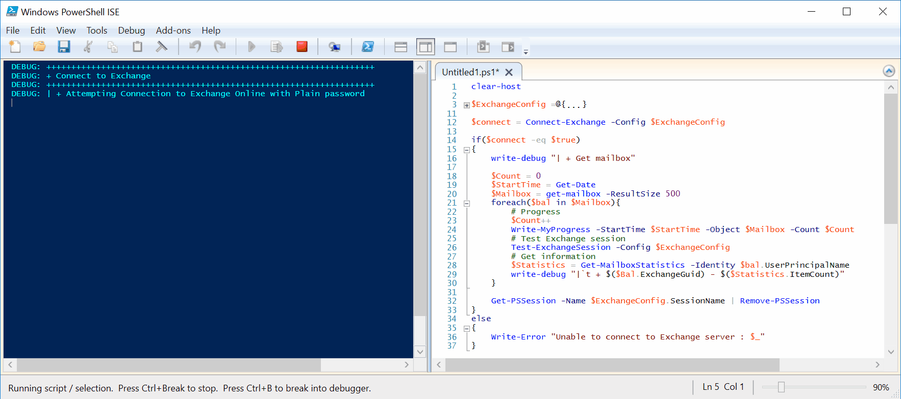

# Invoke-ConnectExchange



## SYNOPSIS  
Simple function to connect into Exchange

## DESCRIPTION
This function will allow you to connect with Exchange using PowerShell.

## NOTES  
  - **File Name**   : Invoke-ConnectExchange.ps1
  - **Author**      : Thomas ILLIET, contact@thomas-illiet.fr
  - **Date**        : 2017-08-01
  - **Last Update** : 2017-08-01
  - **Test Date**   : 2018-01-09
  - **Version**     : 1.1.0

## EXAMPLE
```
#----------------------------------------------
#  With Plain Password
#----------------------------------------------
$ExchangeConfig =@{
    Identity       = "unicorn@microsoft.fr"
    Password       = "BeatifullUnicorne!"
    Authentication = "Basic"
    ConnectionUri  = "https://outlook.office365.com/powershell-liveid/"
    Cmdlet         = @('Set-Mailbox')
    SessionName    = "Exchange"
}
Invoke-ConnectExchange -Config $ExchangeConfig
```

```
#----------------------------------------------
# With SecureString file
#----------------------------------------------
$ExchangeConfig =@{
    Identity       = "unicorn@microsoft.fr"
    PasswordFile   = "c:\Securestring.txt"
    Authentication = "Basic"
    ConnectionUri  = "https://outlook.office365.com/powershell-liveid/"
    Cmdlet         = @('Set-Mailbox')
    SessionName    = "Exchange"
}
Invoke-ConnectExchange -Config $ExchangeConfig
```

```
#----------------------------------------------
# With SecureString file + Key
#----------------------------------------------
$ExchangeConfig =@{
    Identity       = "unicorn@microsoft.fr"
    PasswordFile   = "C:\Securestring.txt"
    KeyFile        = "C:\MyCertificat.key"
    Authentication = "Basic"
    ConnectionUri  = "https://outlook.office365.com/powershell-liveid/"
    Cmdlet         = @('Set-Mailbox')
    SessionName    = "Exchange"
}
Invoke-ConnectExchange -Config $ExchangeConfig
```